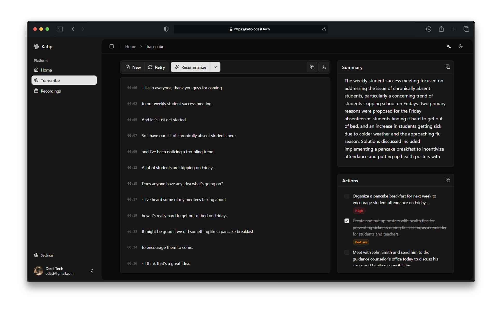

<div align="center">

# Katip

**An AI-powered tool that transcribes, summarizes, and extracts action items from meeting recordings, lectures, and interviews.**

[](https://opensource.org/licenses/GPL-3.0)
[](https://github.com/odest/katip/releases/latest)
[](https://github.com/odest/katip)
[](https://tauri.app)

</div>

<div align="center">
  <picture>
    <source srcset=".github/assets/light.png" media="(prefers-color-scheme: dark)">
    <source srcset=".github/assets/dark.png" media="(prefers-color-scheme: light)">
    
  </picture>
</div>

## What is Katip?

Katip helps you save time by turning long audio recordings into useful summaries and to-do lists. Upload your meeting, lecture, or interview recording, and Katip will:

1. **Transcribe** the audio to text using OpenAI's Whisper
2. **Summarize** the key points and important decisions
3. **Extract** action items and create a task list

Available as a web app, desktop app (Windows, macOS, Linux), and mobile app (Android).

## Features

- 🎙️ **Audio Transcription** - Convert speech to text with Whisper
- 📝 **Smart Summaries** - Get structured summaries of main topics and decisions
- 🤖 **Local LLM Support** - Use Ollama, LM Studio, or Llama.cpp for private, offline summarization
- ☁️ **Cloud LLM Support** - OpenAI, Groq, OpenRouter, Gemini integration
- ✅ **Task Extraction** - Automatically identify and list action items
- 🌍 **Multi-language** - Support for 10 languages
- 💻 **Cross-platform** - Web, desktop, and mobile apps
- 🏠 **Local-First** - Your data stays on your device by default, optional cloud sync
- 🎨 **Modern UI** - Clean interface with dark mode support
- 🔒 **Open Source** - Fully transparent and customizable
- ⚡ **GPU Acceleration** - Vulkan support for faster transcription

## Quick Start

### Prerequisites

- **Node.js** (v20 or higher)
- **pnpm** (v10 or higher)
- **Rust** (latest stable)
- **LLVM** (Windows only, required for whisper-rs compilation)

For mobile development:

- **Android Studio** (for Android)

### Installation

```bash
# Clone the repository
git clone https://github.com/odest/katip.git
cd katip

# Install dependencies
pnpm install

# Start development
pnpm dev
```

### Usage

**Desktop App:**

```bash
# CPU-only (default)
pnpm tauri dev

# With Vulkan GPU acceleration (recommended for AMD/NVIDIA GPUs)
pnpm tauri dev -- --features vulkan
```

**Web App:**

```bash
pnpm --filter web dev
```

**Build for Production:**

```bash
# Desktop (CPU-only)
pnpm tauri build

# Desktop with GPU acceleration
pnpm tauri build -- --features vulkan

# Android
pnpm tauri android build
```

## How It Works

1. **Upload Audio** - Drop your meeting or lecture recording
2. **Transcription** - Whisper converts speech to text
3. **AI Processing** - LLM analyzes the transcript
4. **Get Results** - View summary and action items

### Local LLM Configuration (Web)

If you are using the Web version and want to connect to a local LLM provider like Ollama or LM Studio, you need to configure CORS to allow requests from the browser.

For **Ollama**, set the `OLLAMA_ORIGINS` environment variable before starting the server:

```bash
# Windows (PowerShell)
$env:OLLAMA_ORIGINS="*"; ollama serve

# Mac/Linux
OLLAMA_ORIGINS="*" ollama serve
```

For **LM Studio**, enable CORS in the server settings (Settings → Server → Enable CORS).

### Whisper Models (Native)

For the desktop app, you need to download a Whisper model in ggml format. Models are available at [Hugging Face](https://huggingface.co/ggerganov/whisper.cpp). Recommended models:

- **tiny/base** - Fast, lower accuracy
- **small/medium** - Balanced
- **large-v3-turbo-q5_0** - Best accuracy, requires more resources

## Tech Stack

- **Frontend:** Next.js, React, TypeScript
- **Desktop/Mobile:** Tauri 2.0, Rust
- **Transcription:** whisper.cpp (native), Transformers.js (web)
- **AI:** OpenAI Whisper, OpenAI-compatible LLM providers
- **Styling:** Tailwind CSS, shadcn/ui
- **State:** Zustand
- **Database:** SQLite (local), SQLocal (web), PostgreSQL (cloud sync)
- **Build:** pnpm, Turborepo

## Project Structure

```
katip/
├── apps/
│   ├── native/             # Desktop & mobile (Tauri + Next.js)
│   │   ├── src/            # Next.js frontend
│   │   └── src-tauri/      # Rust backend
│   └── web/                # Web app (Next.js)
├── packages/
│   ├── ui/                 # Shared UI components, hooks, stores
│   ├── database/           # Drizzle ORM schemas (SQLite & PostgreSQL)
│   ├── i18n/               # Translations (10 languages)
│   ├── eslint-config/      # Shared ESLint rules
│   └── typescript-config/  # Shared TypeScript config
```

## Contributing

We welcome contributions! Please check [CONTRIBUTING.md](CONTRIBUTING.md) for guidelines.

## License

This project is licensed under GPL-3.0. See [LICENSE](LICENSE) for details.

## Acknowledgments

Built with [tauri-nextjs-template](https://github.com/odest/tauri-nextjs-template)
